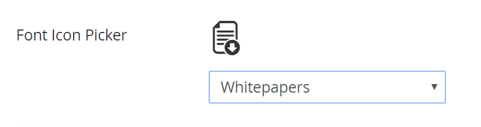

# CostumFontIconPicker
A font icon picker for custom fonts in Umbraco. This Umbraco plugin serves to optimize your icons with custom icon fonts while still allowing your content editors to choose what icons they want. 

<p>
	
</p>

## Install
A) Clone into or download plugin
B) Drop folder into your Umbraco "App_Plugins" directory

## Configurations
A) Open the file CustomFontIconPicker/js/iconList.json and add each of your custom icons, replacing the example code.
```
"twitter": {  			//name of icon, for your references
	"name": "Twitter", 	//name the end user will see
	"class": "twitter" 	//class that the font icon uses to call in CSS
}
```
B) Open the file CustomFontIconPicker/views/fontIconPicker.html and replace the stylesheet linked there with your own custom font stylesheets. You must have already compiled your fonts from a vectorized format to a font.
Note: I use <a href="http://fontastic.me/" target="_blank">Fontastic.me</a> to create my fonts. It's awesome. They don't even pay me to say so.
```
<link href="https://file.myfontastic.com/icons.css" rel="stylesheet">
```